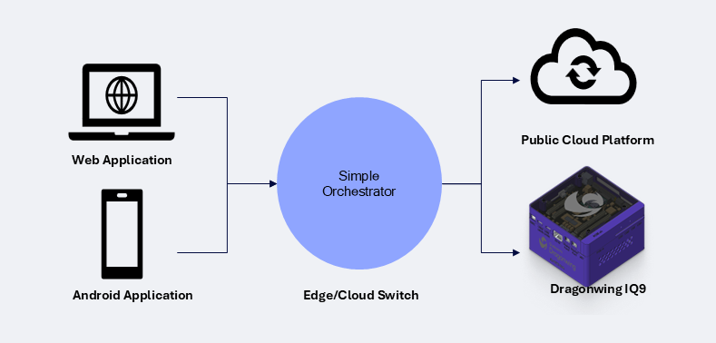
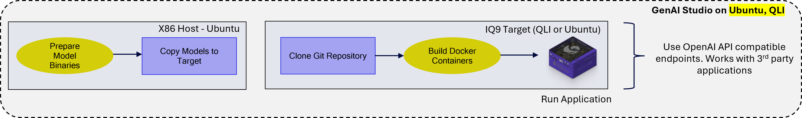
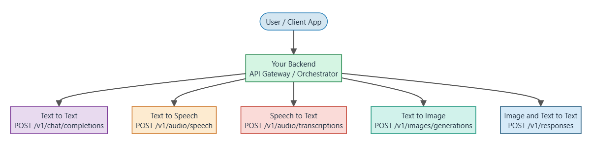

# GenAI Studio

GenAI Studio is a containerized solution to simplify the creation and deployment of Generative AI applications on Qualcomm hardware. It provides OpenAI-compatible APIs for six core services, enabling rapid prototyping and customization of AI workflows.

## Index

- [Introduction](#introduction)
- [Supported Use Cases](#supported-use-cases)
- [Architecture](#architecture)
- [Prerequisites](#prerequisites)
- [Quick Start](#quick-start)
- [Validation and Testing](#validation-and-testing)
- [Single Service Setup](#single-service-setup)
- [Additional Resources](#additional-resources)

## Introduction

GenAI Studio enables developers to build and deploy AI applications on Qualcomm devices with minimal complexity. Each service runs as an independent container, providing isolation, scalability, and extensibility. All services are accessible via OpenAI-compatible API endpoints from any device on the network, enabling seamless integration with existing AI applications and workflows.

### GenAI Studio Overview


### Basic Workflow


### Key Features
1. IQ9 acts as a multi-model, multi-client, and multi-turn inference server
2. IQ9 runs core services, and exposes OpenAI API compatible endpoints
3. Direct compatibility with any OpenAI API compatible 3rd party application - e.g. Anything LLM
4. Verified on IQ9, IQ8, and Ventuno Q
5. With IQ9 - users can compile dockers on IQ9 itself (Verified with GA1.8, and Latest Ubuntu builds)

## Demo 


### Repository Contents

This repository provides a complete GenAI Studio implementation with six independent AI service containers—Text-to-Text, Image-to-Text, Text-to-Image, Speech-to-Text, Text-to-Speech, and Orchestrator. It includes drop-in integration examples for OpenAI-compatible clients across Android, web, C++, and desktop platforms, along with unified validation suites for both service-level and full-stack testing. The repository also contains comprehensive setup guides and troubleshooting documentation, automation helpers for SDK downloads and image preparation, and continuous integration configuration to streamline deployment workflows.

## Supported Use Cases

| Use Case | Description | Model(s) |
|---|---|---|
| **Text-to-Text** | Generates human-like responses with LLM for input prompts. Useful for creating articles, summaries, reports, or creative content automatically. | **LLaMA 3.2-3B**, **Qwen 3-4B** |
| **Text-to-Speech** | Transforms text into clear, natural-sounding audio. Ideal for voice assistants, audiobooks, and accessibility solutions. | **Melo-TTS** |
| **Text-to-Image** | Generates images from text descriptions. Ideal for creating graphics, illustrations, or visual content without manual design. | **Stable Diffusion 2.1** |
| **Speech-to-Text** | Turns spoken words into written text. Helpful for transcription, voice commands, and hands-free applications. | **Whisper Base** |
| **Image-to-Text** | Describes images with natural language. Useful for accessibility, content moderation, and visual understanding. |  **Qwen 2.5-VL-7B** |
| **Orchestrator** | Unified API gateway that routes requests to appropriate services and aggregates responses. | **All above services** |

## Architecture

### High-Level Architecture

Each functional block (Speech-To-Text, Text-to-Text, Text-to-Image, Text-to-Speech, Image-to-Text) runs as an independent container. This provides:
- **Isolation** between services
- **Scalability**: each service can be scaled independently
- **Extensibility**: new modalities or models can be added as additional containers



### Service Endpoints

| Service | Port | Main Endpoint |
|---|---|---|
| Text-to-Text | 8088 | `POST /v1/chat/completions` |
| Image-to-Text | 8080 | `POST /v1/responses` |
| Text-to-Image | 8084 | `POST /v1/images/generations` |
| Speech-to-Text | 8081 | `POST /v1/audio/transcriptions` |
| Text-to-Speech | 8083 | `POST /v1/audio/speech` |
| Orchestrator | 8090 |  |

### Supported OpenAI Compatible Endpoints
- `GET /v1/models`
- `GET /v1/models/{id}`
- `POST /v1/chat/completions`
- `POST /v1/audio/transcriptions`
- `GET /v1/audio/transcriptions/stream`
- `POST /v1/audio/transcriptions/stream`
- `POST /v1/audio/translations`
- `GET /v1/realtime`
- `POST /v1/realtime/sessions`
- `GET /v1/realtime/sessions/{id}`
- `DELETE /v1/realtime/sessions/{id}`
- `POST /v1/realtime/sessions/{id}/audio`
- `POST /v1/realtime/sessions/{id}/finalize`
- `POST /v1/audio/speech`
- `POST /v1/images/generations`
- `GET /v1/images/generations/params`
- `POST /v1/responses`
- `POST /v1/session/reset`

## Prerequisites

### Host Machine Requirements
- Linux x86_64 system (for staging private SDKs via QPM CLI)
- Docker and Docker Compose installed (optional; images are built on target)
- Network connectivity for downloading models and SDKs
- Sufficient disk space (30GB+ recommended)
- QPM CLI (for private SDK access, optional)

### Target Device Requirements (Qualcomm IQ9)
- Qualcomm Ubuntu 24.04 or Qualcomm Linux (QLI)
- Docker and Docker Compose installed
- Qualcomm dependent packages (libqnn, qnn-tools, qcom-fastrpc, libcdsprpc.so.1, libdmabufheap.so.0, etc.)
- CDI (Container Device Interface) configured
- DSP runtime support validated
- Minimum 16GB RAM, 50GB storage

## Quick Start

### 1) Host-side private sdk preparation (optional)

Run this only if you are bringing up the full stack or any private STT or TTS service.

```bash
qpm-cli --login
qpm-cli --install VoiceAI_ASR -v 2.5.0.0 --path /opt/qcom/qpm/VoiceAI_ASR/2.5.0.0 --silent
qpm-cli --install VoiceAI_TTS -v 1.1.1.0 --path /opt/qcom/qpm/VoiceAI_TTS/1.1.1.0 --silent

TARGET_REPO=/path/to/genai-studio-on-target  # Replace with actual path to GenAI Studio repository on target device

rsync -av /opt/qcom/qpm/VoiceAI_ASR/2.5.0.0/whisper_sdk/ \
  ubuntu@<target-host>:${TARGET_REPO}/core-services/speech-to-text/whisper_sdk/

rsync -av /opt/qcom/qpm/VoiceAI_TTS/1.1.1.0/melo_sdk/ \
  ubuntu@<target-host>:${TARGET_REPO}/core-services/text-to-speech/meloTTS/melo_sdk/
```

**Notes:**
- QPM install flow is host-side only. Do not run QPM install on target.
- `VoiceAI_ASR` must be staged to `core-services/speech-to-text/whisper_sdk`.
- `VoiceAI_TTS` must be staged to `core-services/text-to-speech/meloTTS/melo_sdk` (or use `1.1.1.0.zip` fallback in the same folder).

### 2) Target preflight checks and runtime preparation 

Execute on the target device from the repository root directory. 
For initial device provisioning, refer to `docs/setup/DEVICE_SETUP.md` before proceeding.

```bash
# Verify docker and python
docker --version
docker compose version
python3 --version
ls -l /dev/fastrpc-cdsp
ls /etc/cdi/

# Verify QAIRT flat libs and fastrpc lib paths
ls -la /opt/qairt/current/qairt_245_flat_libs/ 2>/dev/null || echo "QAIRT flat libs not yet staged"

# Detect and persist the host RPC library location to .env
unset HOST_RPC_LIB_DIR
for d in /usr/lib/aarch64-linux-gnu /usr/lib; do
  if [ -f "$d/libcdsprpc.so.1" ] && [ -f "$d/libdmabufheap.so.0" ]; then
    export HOST_RPC_LIB_DIR="$d"
    break
  fi
done
[ -n "$HOST_RPC_LIB_DIR" ] || { echo "ERROR: host RPC libs not found"; exit 1; }

echo "HOST_RPC_LIB_DIR=$HOST_RPC_LIB_DIR" > .env
cat .env
```

**Important:** Do not hardcode `HOST_RPC_LIB_DIR`; detect it per device and persist in `.env`. This ensures the variable is available across different shell sessions and subsequent setup steps.

If any checks fail, refer to `DEVICE_SETUP.md` to fix device provisioning.

### 3) Target model preparation

Prepare the model folders under `/opt/genai-studio-models/`. Refer to each service's model setup doc for acquisition details:

| Service | Target Path | Setup Doc |
|---|---|---|
| Text-To-Text | `/opt/genai-studio-models/text-to-text/...` | `core-services/text-to-text/MODEL_SETUP.md` |
| Image-To-Text | `/opt/genai-studio-models/image-to-text/Lemans_LE_Gen2_QNN2_41_qwen25_vl_7B/files` | `core-services/image-to-text/MODEL_SETUP.md` |
| Text-To-Image | `/opt/genai-studio-models/text-to-image/stable_diffusion_v2_1-qnn_context_binary-w8a16-qualcomm_qcs9075` | `core-services/text-to-image/MODEL_SETUP.md` |
| Speech-To-Text | `/opt/genai-studio-models/speech-to-text/whisper_tiny-qnn_context_binary-float-qualcomm_qcs9075` | `core-services/speech-to-text/MODEL_SETUP.md` |
| Text-To-Speech | `/opt/genai-studio-models/text-to-speech/melo-tts-v73/files` | `core-services/text-to-speech/meloTTS/Model-Generation.md` |

### 4) Target shared build preparation

Download QAIRT SDK and build base images (one-time setup):

```bash
bash scripts/download-qairt-sdk.sh --service base
test -d qairt-sdk/include/Genie
test -d qairt-sdk/include/QNN

test -d core-services/speech-to-text/whisper_sdk
test -d core-services/text-to-speech/meloTTS/melo_sdk || \
  test -f core-services/text-to-speech/meloTTS/1.1.1.0.zip

bash scripts/pull-ubuntu-arm64.sh
DOCKER_BUILDKIT=1 docker build --progress=plain -f Dockerfile.runtime -t ubuntu-runtime:24.04 .
DOCKER_BUILDKIT=1 docker build --progress=plain -f Dockerfile.build-base -t genai-build-base:latest .
```

### 5) Service binary and payload requirements

Ensure all required files are in place before building service images:

| Service | Required files/folders | Mount point |
|---|---|---|
| text-to-text | `/opt/genai-studio-models/text-to-text/<model>/genie_config.json` + model bundle | `TG_MODEL_HOST_DIR` |
| image-to-text | `/opt/genai-studio-models/image-to-text/.../files` with `libGenie.so` and model assets | `I2T_MODEL_HOST_DIR` |
| text-to-image | SD2.1 context bins, tokenizer files, QAIRT libs | `IMAGEGEN_MODEL_DIR`, `IMG_QAIRT_LIBS_HOST_DIR` |
| speech-to-text | `core-services/speech-to-text/whisper_sdk` (build-time), runtime model with `encoder.bin`, `decoder.bin`, `vocab.bin`, VAD model | `STT_MODEL_HOST_DIR`, `STT_QNN_LIB_HOST_DIR` |
| text-to-speech | `core-services/text-to-speech/meloTTS/melo_sdk` or `1.1.1.0.zip` (build-time), runtime model with `.qnn` + `libtts_impl_skel.so` | `TTS_MODEL_HOST_DIR` |
| orchestrator | No private SDK; depends on upstream services and `/var/run/docker.sock` | N/A |

### 6) Build service images

```bash
DOCKER_BUILDKIT=1 docker build --progress=plain -t text-to-text:latest core-services/text-to-text/
DOCKER_BUILDKIT=1 docker build --progress=plain -t image-to-text:responses-v1 core-services/image-to-text/
DOCKER_BUILDKIT=1 docker build --progress=plain -t text-to-image:latest core-services/text-to-image/
DOCKER_BUILDKIT=1 docker build --progress=plain -t speech-to-text:latest core-services/speech-to-text/
DOCKER_BUILDKIT=1 docker build --progress=plain -t text-to-speech:latest core-services/text-to-speech/meloTTS/
DOCKER_BUILDKIT=1 docker build --progress=plain -t orchestrator:latest core-services/orchestrator/
```

### 7) Start services with docker compose

Export required environment variables and start the stack:

```bash
export TG_QAIRT_LIBS_HOST_DIR=/opt/qairt/current/qairt_245_flat_libs
export I2T_QAIRT_FLAT_LIB_DIR=/opt/qairt/current/qairt_245_flat_libs
export STT_QNN_LIB_HOST_DIR=/opt/qairt/current/qairt_245_flat_libs
export IMG_QAIRT_LIBS_HOST_DIR=/opt/qairt/current/qairt_245_flat_libs
export TTS_QAIRT_FLAT_LIB_DIR=/opt/qairt/current/qairt_245_flat_libs

export TG_MODEL_DIR=/opt/genai-studio-models/text-to-text/llama_v3_2_3b_instruct_ssd-genie-w4a16-qualcomm_qcs9075
export GENIE_CONFIG=/opt/genai-studio-models/text-to-text/llama_v3_2_3b_instruct_ssd-genie-w4a16-qualcomm_qcs9075/genie_config.json
export BASE_DIR=/opt/genai-studio-models/text-to-text/llama_v3_2_3b_instruct_ssd-genie-w4a16-qualcomm_qcs9075
export I2T_MODEL_HOST_DIR=/opt/genai-studio-models/image-to-text/Lemans_LE_Gen2_QNN2_41_qwen25_vl_7B/files
export STT_MODEL_HOST_DIR=/opt/genai-studio-models/speech-to-text/whisper_tiny-qnn_context_binary-float-qualcomm_qcs9075
export IMAGEGEN_MODEL_DIR=/opt/genai-studio-models/text-to-image/stable_diffusion_v2_1-qnn_context_binary-w8a16-qualcomm_qcs9075
export TTS_MODEL_HOST_DIR=/opt/genai-studio-models/text-to-speech/melo-tts-v73/files
export IMAGE_TO_TEXT_IMAGE=image-to-text:responses-v1
export HF_CACHE_HOST_DIR=/opt/genai-studio-cache/huggingface
mkdir -p "$HF_CACHE_HOST_DIR"

export TTS_ADSP_HOST_DIR=/opt/genai-studio-models/text-to-speech/melo-tts-v73/adsp_runtime_newdevice_bsp/adsp
if [ ! -f "$TTS_ADSP_HOST_DIR/libtts_impl_skel.so" ] && \
   [ -f /opt/genai-studio-models/text-to-speech/melo-tts-v73/adsp_runtime_olddevice_backup/adsp/libtts_impl_skel.so ]; then
  export TTS_ADSP_HOST_DIR=/opt/genai-studio-models/text-to-speech/melo-tts-v73/adsp_runtime_olddevice_backup/adsp
fi

docker compose down --remove-orphans
docker compose up -d
```

Once all services are running, you can:
- **Integrate with OpenAI-compatible clients** – Use the service endpoints directly in any OpenAI-compatible application (see integration examples in [`solutions/README.md`](solutions/README.md))
- **Access via Orchestrator** – Route all requests through the unified gateway at `http://<device-ip>:8090` for simplified multi-service orchestration
- **Run validation tests** – Proceed to the [Validation and Testing](#validation-and-testing) section to verify all services are functioning correctly 

## Validation and Testing

### 1) Clean rebuild (Optional)

Use this when verifying a clean-device or full-stack bring-up, or when troubleshooting persistent issues. This step removes all containers and images before rebuilding to ensure a fresh state without cached layers or stale artifacts. This is particularly useful when:
- Debugging build failures
- Verifying complete end-to-end deployment
- Clearing corrupted or inconsistent container state

```bash
docker compose down --remove-orphans
docker rm -f text-to-text image-to-text text-to-image speech-to-text text-to-speech orchestrator 2>/dev/null || true
docker image rm -f text-to-text:latest image-to-text:latest image-to-text:responses-v1 text-to-image:latest speech-to-text:latest text-to-speech:latest orchestrator:latest 2>/dev/null || true

DOCKER_BUILDKIT=1 docker build --progress=plain -t text-to-text:latest core-services/text-to-text/
DOCKER_BUILDKIT=1 docker build --progress=plain -t image-to-text:responses-v1 core-services/image-to-text/
DOCKER_BUILDKIT=1 docker build --progress=plain -t text-to-image:latest core-services/text-to-image/
DOCKER_BUILDKIT=1 docker build --progress=plain -t speech-to-text:latest core-services/speech-to-text/
DOCKER_BUILDKIT=1 docker build --progress=plain -t text-to-speech:latest core-services/text-to-speech/meloTTS/
DOCKER_BUILDKIT=1 docker build --progress=plain -t orchestrator:latest core-services/orchestrator/

docker compose up -d
docker compose ps
```

### 2) Service health checks and functional tests

**Step 1: Health checks**

Verify all services are running:

```bash
curl -sf http://127.0.0.1:8080/health >/dev/null && echo "Image-to-Text (8080) OK"
curl -sf http://127.0.0.1:8081/health >/dev/null && echo "Speech-to-Text (8081) OK"
curl -sf http://127.0.0.1:8083/health >/dev/null && echo "Text-to-Speech (8083) OK"
curl -sf http://127.0.0.1:8084/health >/dev/null && echo "Text-to-Image (8084) OK"
curl -sf http://127.0.0.1:8088/health >/dev/null && echo "Text-to-Text (8088) OK"
curl -sf http://127.0.0.1:8090/api/status >/dev/null && echo "Orchestrator (8090) OK"
```

**Step 2: Run the unified test suite**

```bash
python3 -m pip install --user -r tests/unified/requirements.txt
python3 tests/unified/run_manifest.py --target-host <TARGET_DEVICE_IP>
```

### 3) Functional endpoint tests

Run these tests to verify each service is working correctly. All tests should return `200` status code with expected response fields.

**Text-To-Text** (port 8088):
```bash
curl -sS -X POST http://127.0.0.1:8088/v1/chat/completions \
  -H 'Content-Type: application/json' \
  -d '{"model":"llama_v3_2_3b_instruct_ssd-genie-w4a16-qualcomm_qcs9075","messages":[{"role":"user","content":"Reply with OK"}],"stream":false,"max_tokens":16}'
```
Expect: `200` + `choices[]`

**Image-To-Text** (port 8080):
```bash
curl -sS -X POST http://127.0.0.1:8090/api/i2t/reset \
  -H 'Content-Type: application/json' \
  -d '{"session_id":"agent-i2t"}' || true

curl -sS -X POST http://127.0.0.1:8080/v1/responses \
  -H 'Content-Type: application/json' \
  -H 'X-Session-Id: agent-i2t' \
  -d '{"model":"qwen2.5-vl-7b-instruct","input":[{"role":"user","content":[{"type":"input_text","text":"Describe image briefly"},{"type":"input_image","image_url":"data:image/png;base64,iVBORw0KGgoAAAANSUhEUgAAAAEAAAABCAQAAAC1HAwCAAAAC0lEQVR42mP8/x8AAwMCAO+tmn8AAAAASUVORK5CYII="}]}],"stream":false,"max_output_tokens":64}'
```
Expect: `200` + `output_text`

**Text-To-Image** (port 8084):
```bash
curl -sS -X POST http://127.0.0.1:8084/v1/images/generations \
  -H 'Content-Type: application/json' \
  -H 'Authorization: Bearer qti-demo-key' \
  --data-raw '{"model":"stable-diffusion-2-1","prompt":"a red square on white background","size":"512x512","response_format":"b64_json"}'
```
Expect: `200` + `data[0].b64_json`

**Speech-To-Text** (port 8081):
```bash
STT_MODEL=$(curl -sS http://127.0.0.1:8081/health | python3 -c 'import sys,json; print(json.load(sys.stdin).get("model","whisper-1"))')
curl -sS -X POST http://127.0.0.1:8081/v1/audio/transcriptions \
  -F file=@tests/unified/fixtures/stt/1.wav \
  -F "model=${STT_MODEL}"
```
Expect: `200` + `text`

**Text-To-Speech** (port 8083):
```bash
curl -sS -o /tmp/tts_smoke.wav -X POST http://127.0.0.1:8083/v1/audio/speech \
  -H 'Content-Type: application/json' \
  -d '{"model":"tts-1","voice":"alloy","input":"Agent smoke test sentence","response_format":"wav"}'
test "$(stat -c%s /tmp/tts_smoke.wav)" -gt 1000 && echo "TTS OK"
```
Expect: `200` + wav file >1000 bytes

**Orchestrator** (port 8090):
```bash
curl -sS http://127.0.0.1:8090/api/status
curl -sS -X POST http://127.0.0.1:8090/v1/chat/completions \
  -H 'Content-Type: application/json' \
  -d '{"model":"genie","messages":[{"role":"user","content":"Reply with OK"}],"stream":false,"max_tokens":16}'
```
Expect: `200` + `/api/status.services[]` + `choices[]`

### 4) Troubleshooting

When any service test fails, collect logs:

```bash
docker compose ps
docker logs --tail 200 text-to-text
docker logs --tail 200 image-to-text
docker logs --tail 200 text-to-image
docker logs --tail 200 speech-to-text
docker logs --tail 200 text-to-speech
docker logs --tail 200 orchestrator
```

Refer to `docs/SIX_SERVICE_PAIN_POINTS.md` for known issues and solutions, or `docs/TROUBLESHOOTING_GUIDE.md` for comprehensive troubleshooting steps.

## Single Service Setup

To bring up only one service:

1. Build only that service image from [section 6) Build service images](#6-build-service-images).
2. Start only that container: `docker compose up -d <service-name>`
3. Run that service's functional test from [section 3) Functional endpoint tests](#3-functional-endpoint-tests).

Each service has its own documentation:

- [`core-services/text-to-text/README.md`](core-services/text-to-text/README.md)
- [`core-services/image-to-text/README.md`](core-services/image-to-text/README.md)
- [`core-services/text-to-image/README.md`](core-services/text-to-image/README.md)
- [`core-services/speech-to-text/README.md`](core-services/speech-to-text/README.md)
- [`core-services/text-to-speech/meloTTS/README.md`](core-services/text-to-speech/meloTTS/README.md)
- [`core-services/orchestrator/README.md`](core-services/orchestrator/README.md)

## Additional Resources
- [`docs/setup/DEVICE_SETUP.md`](docs/setup/DEVICE_SETUP.md) – Device provisioning guide
- [`docs/DOCUMENTATION_INDEX.md`](docs/DOCUMENTATION_INDEX.md) – Complete documentation index and navigation guide
- [`docs/TROUBLESHOOTING_GUIDE.md`](docs/TROUBLESHOOTING_GUIDE.md) – Comprehensive troubleshooting guide
- [`docs/SIX_SERVICE_PAIN_POINTS.md`](docs/SIX_SERVICE_PAIN_POINTS.md) – Known issues and solutions
- [`docs/API_CONTRACTS.md`](docs/API_CONTRACTS.md) – API specifications and contracts
- [`docs/NPU_ARBITRATION_RUNBOOK.md`](docs/NPU_ARBITRATION_RUNBOOK.md) – NPU resource management guide
- [`core-services/README.md`](core-services/README.md) – Service architecture details

