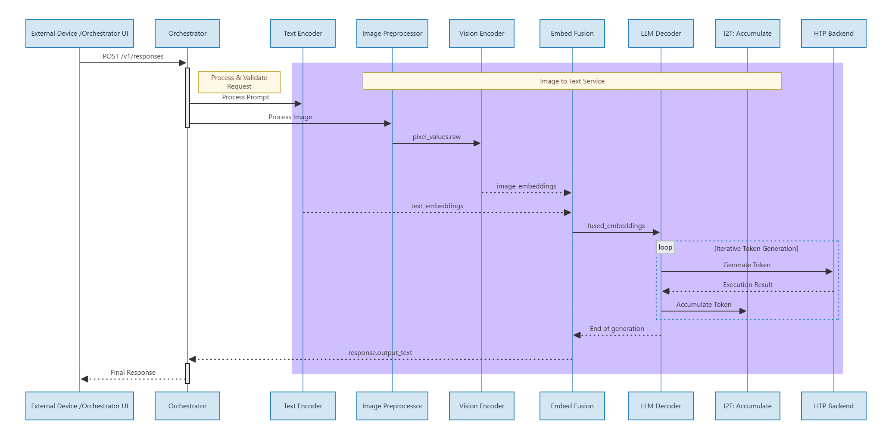

# Image-To-Text Code Flow

## Goal

Describe the runtime path for Image-To-Text after migration to OpenAI Responses.

## Canonical Path

- Direct endpoint: `POST /v1/responses` on I2T service (`:8080`)
- Request format: OpenAI Responses `input[]`
- Image handling: server-side preprocessing inside I2T container (`preprocess.py`)

## Components

- Backend service: `core-services/image-to-text/src/server_sse.cpp`
- In-container preprocessing: `core-services/image-to-text/src/preprocess.py`
- Orchestrator OpenAI gateway: `core-services/orchestrator/app/openai.py` (`POST /v1/responses`)

## Direct Request Flow

The request flow follows these steps:
1. POST request arrives at `/v1/responses`
2. JSON and input validation occurs
3. If image input is present, preprocessing runs via `preprocess.py` in the container
4. Pixel values are generated and stored in the uploads directory
5. Vision inference is executed
6. Response is returned as native response object or SSE stream

## Input Validation Rules

- `input` must be non-empty array.
- `stream` must be boolean when present.
- `image_url` sources allowed: `https://` and `data:`.
- `pixel_values_path` rejected with `400`.

## Orchestrator Gateway Behavior

- Orchestrator routes I2T inference through `POST /v1/responses`.
- Orchestrator rejects I2T payloads sent to `/v1/chat/completions` with `400` and guidance to use `/v1/responses`.

## Session Behavior

- Session id is passed through `X-Session-Id`.
- If not supplied, backend uses `__default__`.
- Same session id should be reused across turns for continuity.

## Removed Legacy Surface

- Direct `/v1/chat/completions` and `/v1/vision/chat/completions` are not registered.
- Orchestrator `/api/i2t/preprocess`, `/api/i2t/vision`, and `/api/i2t/chat` are removed.
