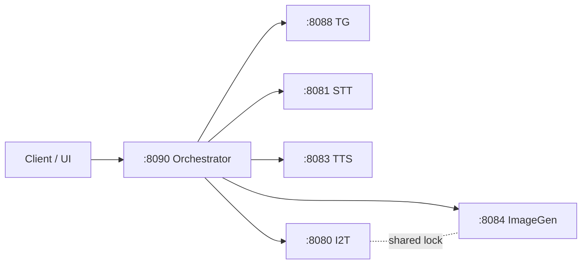

# Orchestrator Service

Orchestrator is the gateway and UI backend.
It unifies all backend services under OpenAI-style routes on port `8090`.

Canonical build/run/rebuild commands live in repo-root `README.md`:

1. `One Bring-Up Path`
2. `Strict clean rebuild cycle`
3. `Six-service functional tests`

Shared contracts and troubleshooting:
- [`docs/API_CONTRACTS.md`](../../docs/API_CONTRACTS.md)
- [`docs/TROUBLESHOOTING_GUIDE.md`](../../docs/TROUBLESHOOTING_GUIDE.md)

## Request Routing Flow



## 1) Dependency Checklist

Orchestrator has no native model-generation step.
It depends on backend services and mounted paths (especially I2T model path and HF cache).

Minimum checks before starting orchestrator:

```bash
docker ps --format '{{.Names}}' | egrep 'text-to-text|image-to-text|text-to-image|speech-to-text|text-to-speech' || true
test -d /opt/genai-studio-models/image-to-text/Lemans_LE_Gen2_QNN2_41_qwen25_vl_7B/files
echo "${HF_CACHE_HOST_DIR:-/opt/genai-studio-cache/huggingface}"
```

Optional deep reference:

- `core-services/orchestrator/SETUP.md`

## 2) Build and Start Service 

Build the orchestrator image

```bash
DOCKER_BUILDKIT=1 docker build --progress=plain -t orchestrator:latest core-services/orchestrator/
```

Start the orchestrator service

Ensure all backend services are running (text-to-text, image-to-text, text-to-image, speech-to-text, text-to-speech).

Then run:

```bash
docker compose up -d orchestrator
```

To start orchestrator without any dependencies, run:

```bash
docker compose up --no-deps -d orchestrator
```

For full stack bring-up, refer to `README.md` [section 7) Start services with docker compose](#7-start-services-with-docker-compose). (Recommended)

## 3) Validate

```bash
curl -s http://localhost:8090/health
curl -s http://localhost:8090/api/status | python3 -m json.tool
```

Expected response shape:

```json
{
  "health": {"status":"ok"},
  "status": {"services":[{"name":"text_generation","status":"ok"}]}
}
```

Status semantics:

- `/health`: orchestrator process liveness only.
- `/api/status`: per-service liveness + readiness details (`ready_status`).

UI:

- `http://<device-ip>:8090/`

## 4) Main Routes

### 4.1 UI/helper routes

- `GET /api/status`
- `POST /api/tg/chat`
- `POST /api/stt/transcribe`
- `POST /api/tts/speech`
- `POST /api/img/generate`
- `POST /api/i2t/reset`

### 4.2 Unified OpenAI-style routes

- `GET /v1/models`
- `POST /v1/responses` (Image-To-Text canonical multimodal route)
- `POST /v1/chat/completions`
- `POST /v1/audio/transcriptions`
- `POST /v1/audio/translations`
- `POST /v1/audio/speech`
- `POST /v1/images/generations`
- `POST /v1/images/edits`
- `POST /v1/images/variations`
- realtime STT routes under `/v1/realtime*` (advanced only)

### 4.3 STT endpoint selection

Client-facing STT traffic should go through orchestrator (`:8090`) only.

| Endpoint | Use when | Notes |
|---|---|---|
| `POST /api/stt/transcribe` | Recommended default for app/UI uploads | Simplest orchestrator STT path |
| `POST /v1/audio/transcriptions` | OpenAI-compatible client contract needed | Default model is `whisper-tiny` |
| `POST /v1/audio/translations` | Speech-to-English translation required | OpenAI-compatible |
| `/v1/realtime/*` | Advanced chunk session flow only | Pre-recorded uploaded audio chunks (`create -> append -> finalize`); websocket listing is compatibility-only for custom clients |

## 5) Code Layout

Orchestrator logic is split by use case:

- `core-services/orchestrator/device_app.py` — FastAPI app wiring only
- `core-services/orchestrator/app/system.py` — UI + health/status routes
- `core-services/orchestrator/app/tg.py` — Text-Generation routes
- `core-services/orchestrator/app/stt.py` — Speech-To-Text routes (HTTP + websocket realtime)
- `core-services/orchestrator/app/imagegen.py` — Image-Generation routes and arbitration logic
- `core-services/orchestrator/app/i2t.py` — I2T readiness/model/reset helpers
- `core-services/orchestrator/app/openai.py` — OpenAI-compatible gateway routes
- `core-services/orchestrator/app/common.py` — shared proxy/timing/request helpers
- `core-services/orchestrator/app/context.py` — env config + shared HTTP/OpenAI clients

## 6) NPU Arbitration (I2T + ImageGen)

On this device class, Image-To-Text and Image-Generation share the same accelerator.
Orchestrator now serializes these workloads with a shared NPU lock to avoid QNN `deviceCreate` failures (`rc=256` / `14001`) during overlap.

Recommended:

- Send image-generation through orchestrator (`:8090`) routes.
- Do not call `:8084` directly from clients; treat it as backend-internal only.

Runtime knobs:

- `NPU_ARB_ENABLED` (default `1`)
- `NPU_ARB_TIMEOUT_SEC` (default `180`)
- `IMG_I2T_ARBITRATION_ENABLED` fallback retry path (default `0` in code; set `1` in compose)

Response behavior:

- Success responses include `X-Npu-Wait-Ms` for observability.
- If lock wait exceeds timeout, orchestrator returns `429` with `error.type=npu_busy` and `Retry-After`.

Detailed runbook:

- `docs/NPU_ARBITRATION_RUNBOOK.md`

## 7) Text Generation Single-Flight Guard

For reliability-focused single-client deployment, orchestrator enforces one in-flight text-generation request at a time.

- Lock scope: `/api/tg/chat`, `/api/tg/load-model`, `/api/tg/reset`
- Wait timeout: `TG_SINGLE_FLIGHT_TIMEOUT_SEC` (default `30`)
- Busy response: HTTP `503` with `error.code=model_busy` and `Retry-After`
- Internal key propagation (placeholder by default): `TG_INTERNAL_API_KEY`

Text model routing contract:

- client-facing id (orchestrator): `genie` (`TG_ORCHESTRATOR_MODEL_ID`)
- direct backend id (Text-Generation): `llama3.2-3B` (`TG_DIRECT_MODEL_ID`)
- unknown text model ids are rejected with deterministic `400 invalid_request_error`

## 8) Common Issues

- backend unavailable: check `/api/status` and service container health.
- stale UI behavior: rebuild orchestrator image and hard refresh browser (`Ctrl+Shift+R`).
- I2T image preprocessing failure: verify I2T container HF cache mount and valid `input_image.image_url`.
- I2T payload sent to `/v1/chat/completions`: use `POST /v1/responses` for all I2T turns.
- repeated I2T pipeline `status=4`: call `/api/i2t/reset` for active `session_id`, then retry `POST /v1/responses`.
- ImageGen `rc=256` under mixed I2T traffic: use orchestrator `:8090` route and ensure `NPU_ARB_ENABLED=1`.

Expected error response shape (top failure):

```json
{
  "error": {
    "type": "server_error",
    "code": "model_busy",
    "message": "text_generation request already in flight"
  }
}
```
