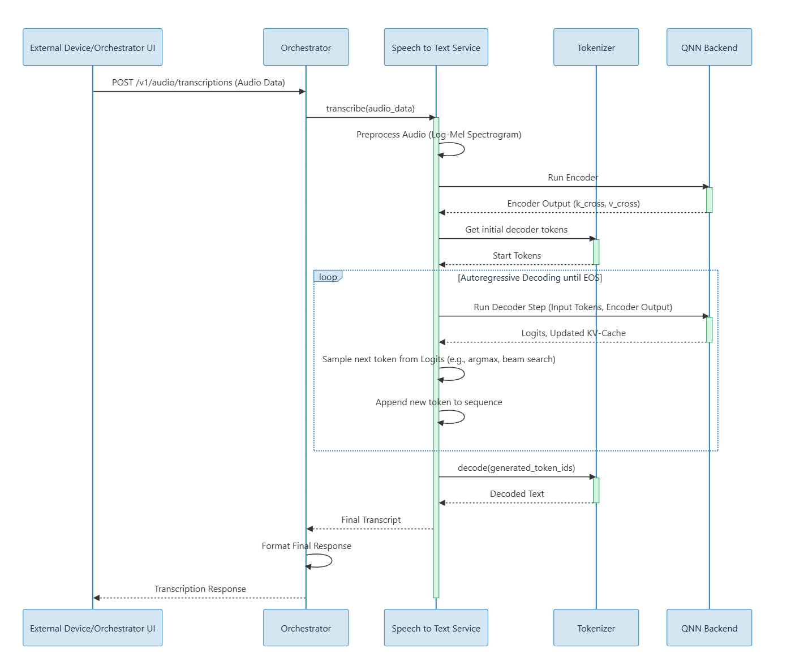
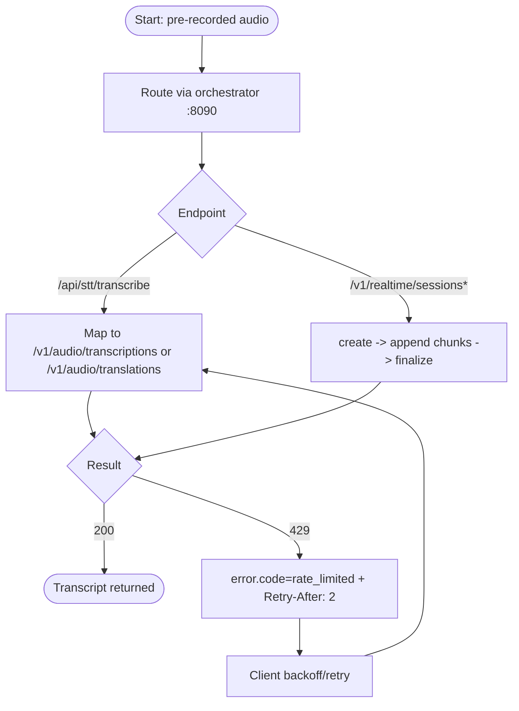

# Speech-To-Text Code Flow


This document explains backend flow inside `Speech-To-Text` from HTTP request to transcription response.
Client-facing STT traffic is expected through orchestrator (`:8090`); direct `:8081` is backend/debug path.



## 1) Entry and Composition

- `src/main.cpp`
  - parses CLI args (`--model-path`, `--vad-model-path`, `--port`)
  - validates runtime config
  - starts `AsrService::run()`

- `src/AsrService.hpp`
  - service contract and route registration methods
  - owns `WhisperEngine`, config, counters, realtime store

## 2) Route Registration Split

- `src/OpenAiRoutes.cpp`
  - OpenAI-style routes:
    - `POST /v1/audio/transcriptions`
    - `POST /v1/audio/transcriptions/stream`
    - `POST /v1/audio/translations`

- `src/RealtimeRoutes.cpp`
  - realtime metadata + session lifecycle:
    - `GET /v1/realtime`
    - `POST /v1/realtime/sessions`
    - `GET /v1/realtime/sessions/{id}`
    - `DELETE /v1/realtime/sessions/{id}`

- `src/RealtimeSessionHandlers.cpp`
  - realtime data plane:
    - `POST /v1/realtime/sessions/{id}/audio`
    - `POST /v1/realtime/sessions/{id}/finalize`

- `src/HttpPolicies.cpp`
  - method-not-allowed routes (`405`)
  - post-routing canonical error normalization and request-id handling
  - exception and error handlers

### 2.1 Endpoint intent summary

| Surface | Primary intent | Notes |
|---|---|---|
| `/v1/audio/*` | OpenAI-compatible contract | Primary path for normal uploaded audio files |
| `/v1/realtime/*` | Stateful HTTP chunk flow | Advanced flow for pre-recorded PCM chunks, then finalize |

## 3) Request Processing Pipeline

### 3.1 Mermaid user-visible flow (policy aligned)



### Multipart audio routes

1. Request shape/method validation
2. Multipart field checks (`file` or `audio`)
3. Content-type/extension/magic-byte checks
4. Payload size checks
5. Temp file write with RAII cleanup
6. Timed engine lock acquisition
7. Whisper inference
8. Response formatting (`json/text/verbose_json/srt/vtt/diarized_json`)
9. Timing headers + `x_timing` body fields

### OpenAI audio request contract (summary)

For service operation flow, see `core-services/speech-to-text/README.md`.
For full cross-service API contract semantics, see `docs/API_CONTRACTS.md`.

Transcriptions and translations accept multipart fields:

- `file` (required)
- `model` (required; accepted ids: `whisper-tiny`, `whisper-1`, `gpt-4o-transcribe`)
- `response_format` (optional; defaults `json`)
- `language` (transcriptions only; defaults `en`)
- `stream` (optional; enables SSE when true)
  - exception: transcriptions with `model=whisper-tiny` force non-stream mode.
- `include` / `include[]` (transcriptions only; `logprobs` rejected)
- `timestamp_granularities` / `timestamp_granularities[]` (transcriptions only; requires `verbose_json`)

Default response (JSON):

```json
{
  "text": "hello world",
  "x_timing": {
    "request_total_ms": 12.3,
    "engine_total_ms": 10.1
  }
}
```

### Realtime session create route

- Parses JSON body (must be object)
- Strictly validates known field types
- Ignores unknown fields
- Applies sane bounds/sanitization for numeric controls
- Stores session in `RealtimeSessionStore`
- Defaults model to `whisper-tiny` if missing/empty

## 4) Realtime Session Data Flow

- `src/RealtimeSessionStore.cpp`
  - centralized session map + locking
  - TTL expiry handling
  - total pending PCM accounting
  - helpers for atomic read/update mutation

- `handleRealtimeAudioAppend`
  - validates PCM payload
  - computes RMS and VAD state
  - enforces per-session and global pending limits
  - conditionally commits segment and transcribes
  - appends segment text back to session
  - preserves append ordering per session through locked mutation path

- `handleRealtimeFinalize`
  - drains pending PCM
  - performs final transcription pass
  - returns consolidated transcript and segments
  - keeps session available after finalize until explicit delete or TTL expiry

## 5) Engine Lifecycle

- `src/WhisperEngine.hpp/.cpp`
  - initializes runtime once (`initialize()`)
  - resolves encoder/decoder/vocab/VAD assets
  - bridges callback-driven runtime to blocking request lifecycle through listener synchronization

- `src/TranscriptionExecutor.cpp`
  - shared orchestration for file and PCM transcription
  - lock timeout to prevent indefinite blocking
  - rollback hooks for realtime pending buffers on failure

## 6) Error and Busy Semantics

- `src/ErrorResponder.cpp` defines canonical error shape normalization.
- STT busy/capacity policy for clients is `429` with `error.code=rate_limited`.
- Unknown/invalid known realtime create types return `400 invalid_request_error`.
- Unknown realtime create keys are ignored (for forward-compatible clients).

## 7) Concurrency and Safety

- Service-level `std::timed_mutex` protects engine access across HTTP requests.
- Engine-level serialization protects Whisper runtime state.
- Temp file cleanup is RAII-based.
- Exception handlers prevent process crash on malformed requests.
- Realtime session mutation is centralized in `RealtimeSessionStore` to keep session updates consistent.

## 8) Build and Runtime Integration

- `core-services/speech-to-text/build.sh`
  - prepares SDK slice and image build
- `core-services/speech-to-text/run.sh`
  - sets ADSP/LD runtime paths
  - checks required model files
  - starts `asr-service`

## 9) Update Rule

When endpoint behavior changes, update all in same change:

- `README.md` (external contract)
- `CODE_FLOW.md` (internal flow)
- relevant `test_*.py` (contract validation)
