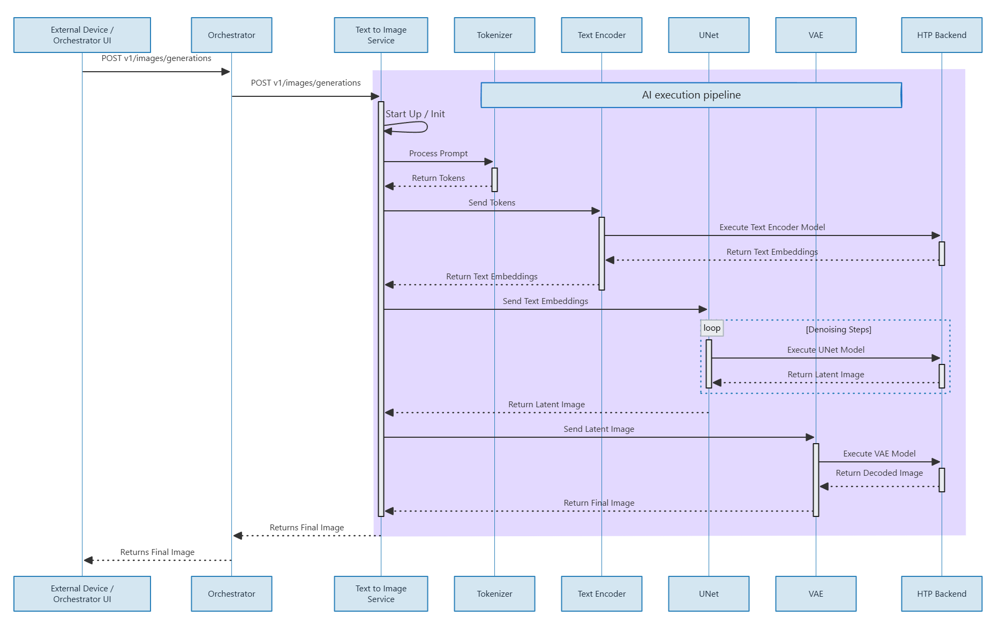

# Image-Generation Code Flow

This document describes how Image-Generation handles OpenAI-style image requests end-to-end.

## 1) Entry and Startup

- `src/main.cpp`
  - parses CLI options:
    - `--model-dir`
    - `--tokenizer-dir`
    - `--port`
    - `--api-key`
    - `--cache-size`
  - constructs `ImageGenService`
  - starts blocking HTTP loop

## 2) Service Layer

- `src/ImageGenService.cpp`
  - sets up HTTP routes
  - validates auth and request schema
  - normalizes model aliases to `stable-diffusion-2-1`
  - handles cache lookup/insert
  - dispatches generation to `StableDiffusionEngine`
  - supports URL-style image retrieval via in-memory image store

Implemented routes include:

- `GET /health`
- `GET /v1/models`, `GET /v1/models/{id}`
- `GET /v1/images/generations/params`
- `GET /v1/images/files/{image_id}`
- `POST /v1/images/generations`
- `POST /v1/images/edits`
- `POST /v1/images/variations`
- `POST /generate` (legacy)

## 3) Engine Layer

- `src/StableDiffusionEngine.cpp`
  - loads QNN backend and required runtime symbols
  - validates and loads context binaries
  - loads tokenizer resources
  - runs SD pipeline stages:
    1. text tokenize
    2. text encode
    3. latent init
    4. denoise loop (UNet/scheduler)
    5. VAE decode
    6. PNG encode
  - records stage-level timing metrics

### Direct runner selection

Runner resolution priority:

1. `SD21_RUNNER_PATH` env override (if valid)
2. `<model-dir>/cpp_sd21_qnn_direct/sd21_qnn_cpp_direct`
3. `/usr/bin/sd21_qnn_cpp_direct`

Environment toggle:

- `SD21_PREFER_IMAGE_RUNNER=1` can prioritize image-embedded runner first.

## 4) Request Processing Flow (`/v1/images/generations`)

In `ImageGenService.cpp`:

1. parse JSON body
2. validate required fields (`prompt`, optional params)
3. canonicalize model ID
4. clamp/normalize generation params (`steps`, `guidance_scale`, dimensions)
5. cache lookup by deterministic request key
6. if miss:
   - call engine generation
   - encode/store output
   - persist in in-memory cache/LRU
7. shape OpenAI-compatible response (`url` or `b64_json`)
8. attach timing metadata and headers

## 5) Edits / Variations Flow

- multipart form parsing in service layer
- input image is decoded and fed through the same generation backend path
- response format handling matches generation route semantics

## 6) Timing and Metrics

Service and engine expose timing fields such as:

- request parse/total
- engine total
- tokenize/text encode/denoise/vae decode/png encode
- cache hit indicators

These are surfaced in response body (`x_timing`) and headers (`X-*`) where applicable.

## 7) Build and Runtime Integration

- Build pipeline:
  - `core-services/text-to-image/build.sh`
  - `core-services/text-to-image/Dockerfile`
- Runtime prep pipeline:
  - `core-services/text-to-image/model_generation_scripts/prepare_sd21_runtime.py` (legacy optional helper)
- Runtime bootstrap:
  - `core-services/text-to-image/run.sh`

`run.sh` validates runtime model/lib/tokenizer files before starting the service.

## 8) External Dependencies in Source Tree

- `deps/cpp_sd21_qnn/main_direct_qnn.cpp`
  - compiled into `/usr/bin/sd21_qnn_cpp_direct`
- `src/ClipTokenizer.*`
  - tokenizer integration
- `src/DpmScheduler.*`
  - denoise scheduler behavior

## 9) Failure Modes and Recovery Points

- model/runtime validation failures are returned as `400`/`500` with structured error body
- unsupported model names are rejected with explicit `invalid_request_error`
- in-memory image URL cache includes TTL-based pruning
- auth check is enforced when `--api-key` or `IMAGE_GEN_API_KEY` is configured
