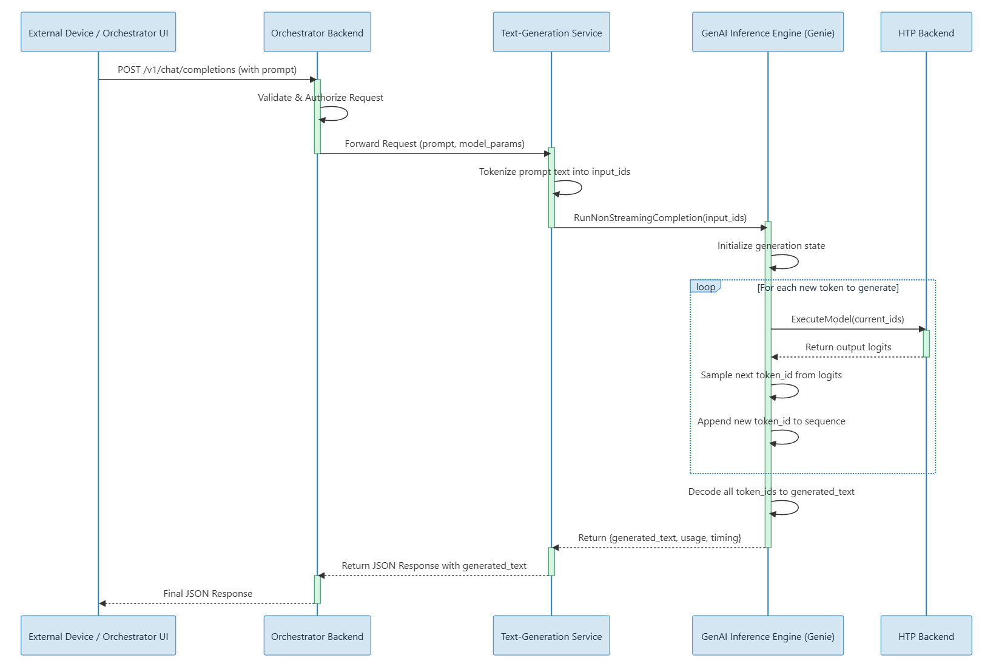

# Text-Generation Code Flow

This document explains how `Text-Generation` handles a request from HTTP ingress to token output.
It is maintainer-focused and complements:

## Golden Path

1. [../../README.md](../../README.md)
2. [../../docs/setup/DEVICE_SETUP.md](../../docs/setup/DEVICE_SETUP.md) only if provisioning checks are needed
3. [../../docs/DEBUG_PLAYBOOK.md](../../docs/DEBUG_PLAYBOOK.md) for troubleshooting
4. [MODEL_SETUP.md](MODEL_SETUP.md)
5. [README.md](README.md) for operator validation flow

## 1) Entry and Initialization

- `src/Main.cpp`
  - parses CLI args (`--genie-config`, `--base-dir`)
  - reads Genie JSON config
  - sets working directory to model base dir
  - constructs `App::ChatApp` and enters server/chat loop

- `src/Genie.cpp`
  - owns Genie dialog/config handles
  - initializes Genie runtime (`GenieDialogConfig_createFromJson`, `GenieDialog_create`)
  - exposes:
    - `query()` for blocking inference
    - `queryStream()` for token streaming callback
    - `reset()`, `reload()`, `setMaxTokens()`

## 2) HTTP Server and Endpoint Wiring

- `src/ChatApp.cpp`
  - creates and configures `httplib::Server`
  - registers exception and error handlers
  - delegates route registration to focused route modules under `src/server/`

Route/module ownership:

- `src/server/ModelRoutes.cpp`
  - public model routes (`/v1/models*`)
  - internal model management (`/v1/internal/models*`)
  - health/readiness (`/health`, `/ready`)
- `src/server/CompletionRoutes.cpp`
  - chat completions (`/v1/chat/completions`)
  - stored completion lifecycle routes
- `src/server/LegacyRoutes.cpp`
  - compatibility route handler implementation (`/reload_model` and internal legacy paths)
- `src/server/CompletionService.cpp`
  - shared execution service for `POST /v1/chat/completions`
- `src/server/CompletionRuntime.cpp`
  - prompt assembly, token queue, timing, stored-completion backing store
- `src/server/ServerUtils.cpp`
  - JSON-safe access helpers + canonical JSON error shape
- `src/server/ModelAccessPolicy.hpp`
  - lock timeout + retry header policy

Primary routes:

- `GET /health`
- `GET /ready`
- `GET /v1/models`
- `GET /v1/models/{id}`
- `POST /v1/chat/completions`

Stored completion lifecycle routes (`store=true` path):

- `GET /v1/chat/completions`
- `GET /v1/chat/completions/{id}`
- `DELETE /v1/chat/completions/{id}`
- `GET /v1/chat/completions/{id}/messages`

Compatibility route:

- `POST /reload_model`

## 3) Shared Internal Execution Path

Prompt construction is centralized:

- `CompletionRuntime::BuildPromptFromMessages(...)` is the single prompt builder.
- `POST /v1/chat/completions` uses it directly via `CompletionService`.
- compatibility handlers also delegate through this same prompt builder path.

This keeps prompt behavior aligned across primary and legacy paths.

## 4) `/v1/chat/completions` Request Path

`CompletionService::HandleChatCompletionPost(...)` pipeline:

1. **Body guard**
   - rejects body > 10 MB (`413`)
2. **JSON parse + schema checks**
   - validates `messages` as non-empty array
   - validates element types/roles/content
   - validates primitive field types strictly (`model` string, `stream`/`store` booleans, token fields integers)
   - rejects wrong field types (no silent type coercion)
   - rejects unsupported OpenAI fields for this backend
3. **Prompt construction**
   - builds prompt using role-aware formatter
   - ensures at least one non-empty `user` message exists
4. **Token controls**
   - resolves `max_tokens`
   - clamps to safe bounds
5. **Genie lock acquisition**
   - uses `std::timed_mutex` with timeout
   - timeout policy: `ModelAccessPolicy::kBusyWaitTimeout = 30s`
   - returns `503` (`model_busy`) with `Retry-After: 2` when lock wait expires
6. **Inference execution**
   - streaming: launches worker thread calling `genie_.queryStream`
   - non-streaming: accumulates tokens synchronously
7. **Response generation**
   - OpenAI-shaped completion payload
   - SSE chunks for stream mode (`data: ...`, `[DONE]`)
   - usage + timing metrics included

## 5) Streaming Internals

- `TokenQueue` in `src/server/CompletionRuntime.cpp` bridges inference callback → SSE sender
- captures:
  - first-token timestamp
  - token count
  - last-token timestamp
  - cancellation state
- on client disconnect:
  - queue cancellation is propagated
  - token emission stops cleanly

## 6) Timing Metrics

`src/server/CompletionService.cpp` tracks and emits both inference and orchestration stages:

- prefill / TTFT
- generation duration
- total request duration
- tokens/sec
- inter-token latency
- parse / validate / prompt-build / lock-wait / inference stage timings

These appear in headers and/or JSON (`x_timing`) depending on mode.

## 7) Stored Completion Lifecycle

- In-memory store is managed in `CompletionRuntime.cpp`.
- Current capacity: `200` completions (`kStoreCapacity`).
- Stored entries are created when chat request sets `"store": true`.
- Lifecycle endpoints:
  - `GET /v1/chat/completions`
  - `GET /v1/chat/completions/{id}`
  - `GET /v1/chat/completions/{id}/messages`
  - `DELETE /v1/chat/completions/{id}`

## 8) Error Contract

- Canonical JSON errors are built by `ServerUtils::SetJsonError(...)`.
- Error payload shape is:
  - `error.message`
  - `error.type`
  - `error.code` (defaults to `error.type` when not explicitly set)
  - `error.param` (`null` when not set)
- Wrong method handlers on completion routes return `405` with explicit message.
- Parse and validation failures return `400` `invalid_request_error`.
- Busy model path returns `503` + retry hint.

## 9) Concurrency and Safety

- timed model mutex prevents deadlock under load
- explicit wrong-method handlers return `405` instead of ambiguous `404`
- robust input guards for malformed/null/non-string fields
- global exception handler prevents server crashes from uncaught exceptions

## 10) Compatibility Behavior

- `/reload_model`
  - supports model config switch and prompt/sampler updates
  - drains active stream workers before model switch
  - applies same busy/lock policy when contested

## 11) Build/Runtime Integration

- build graph:
  - `core-services/text-to-text/build.sh`
  - `core-services/text-to-text/Dockerfile`
- runtime bootstrap:
  - `core-services/text-to-text/run.sh`
  - resolves active model bundle and launches `textgen_server` (`llamachat` alias kept)
