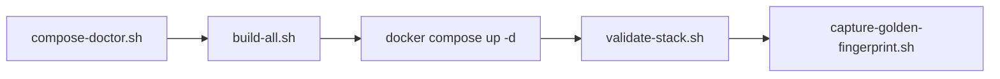

# Scripts Layout

This folder is organized by function so bring-up is reproducible and easier to follow.

Related docs:
- `docs/README.md`
- `docs/API_CONTRACTS.md`
- `docs/TROUBLESHOOTING_GUIDE.md`

## Script Flow



## Core entrypoints

- `scripts/build-all.sh`  
  Builds shared base images and all service images.
  It now skips rebuilding existing base images by default and supports `--force-base-rebuild`.
  It also fail-fast checks/prepares `qairt-sdk/` before base-image build.
- `scripts/compose-doctor.sh`  
  Validates resolved compose configuration and host path prerequisites.
- `scripts/validate-stack.sh`  
  Runs deterministic end-to-end smoke checks and stores evidence under `test-evidence/`.
- `scripts/capture-golden-fingerprint.sh`  
  Captures release fingerprint (commit, model set, QAIRT, tooling/runtime dependencies).


## Structure

- `scripts/repro/`  
  Reproducibility flows (`compose_doctor.sh`, `run_full_stack_smoke.sh`).
- `scripts/lib/`  
  Shared shell helpers used by scripts.
- `scripts/pull-ubuntu-arm64.sh`, `scripts/create-runtime-base.sh`, `scripts/download-qairt-sdk.sh`  
  Base image and SDK-slice helpers.

## Typical sequence

Prerequisite: complete service model setup first (`MODEL_SETUP.md` / `Model-Generation.md` in each service directory under `core-services/`).

```bash
# Run this on target device
test -f docker-compose.yml || { echo "Run from repo root"; exit 1; }
[ -f .env ] || { echo "Create .env with HOST_RPC_LIB_DIR from README.md"; exit 1; }
test -f versions.env || { echo "Missing versions.env"; exit 1; }
set -a && source versions.env && set +a
bash scripts/compose-doctor.sh --strict
bash scripts/build-all.sh
docker compose up -d
bash scripts/validate-stack.sh --skip-start
bash scripts/capture-golden-fingerprint.sh
```

If repeated smoke runs fail only at `I2T_VISION` (`409 session_conflict`), restart I2T before rerun:

```bash
docker restart image-to-text
bash scripts/repro/run_full_stack_smoke.sh
```

## Transparency note

If you want to see backend steps explicitly, use:

- per-service build scripts (`core-services/text-to-text/build.sh`, `core-services/image-to-text/build.sh`, `core-services/speech-to-text/build.sh`)
- manual `docker build` commands from repo-root `README.md`
- troubleshooting checks from `docs/TROUBLESHOOTING_GUIDE.md`

`scripts/build-all.sh` is only a deterministic wrapper around those steps; it does not hide extra undocumented behavior.
